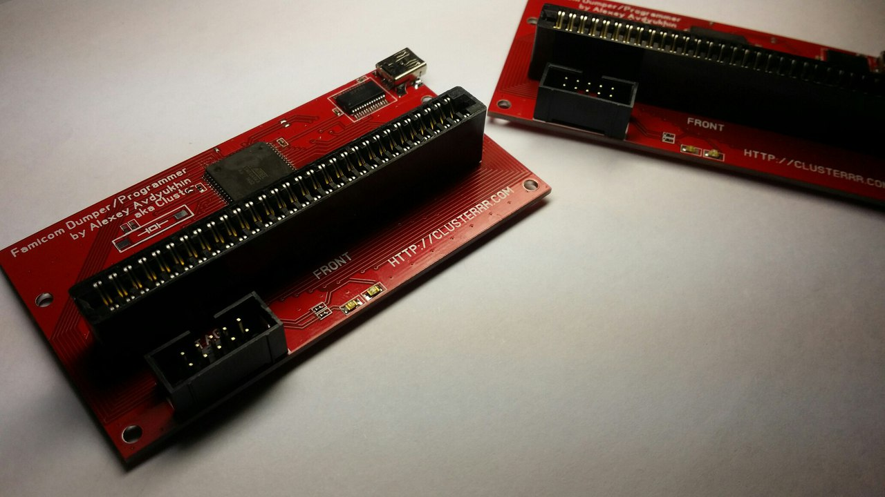
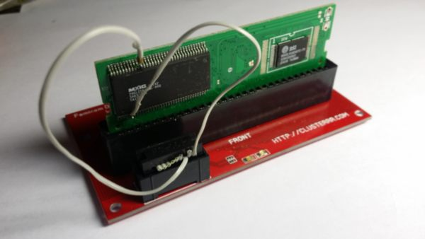

# Famicom Dumper/Programmer

## Overview

This is simple dumper/programmer for Famicom cartridges.

You can use it to:
* Dump cartridges, so you can play copy of your cartridge on emulator
* Read/write battery backed saves, so you can continue your saved game on emulator/console
* Write spetial cartridges like [COOLGIRL](https://github.com/ClusterM/coolgirl-famicom-multicard)
* Rewrite ultracheap chinese COOLBOY cartridges. Soldering required but it's very simple.
* Test your cartridges
* Some reverse engineering
* Anything else that requires Famicom bus simulation

## Schematics and parts list

You need:
* ATMEGA64
* FT232RL
* 60-pin edge socket
* Maybe some leds

That's all! 

## How to compile firmware

All you need is [WinAVR](http://winavr.sourceforge.net/)
Just type "make hex" in command line to compile firmware or bootloader.

## How to build it

You need to flash ATMEGA64 microcontroll using any AVR programmer. It's recommended to program bootloader first, so you can flash/update firmware via USB. I'm using bootloader by Martin Thomas, you can use already configured one in bootloader folder. There are fuses for it:
* LFUSE          = E4
* HFUSE          = DC
* EFUSE          = FF

You can program it using command like "**make program PROGRAMMER_TYPE=avrisp2 PROGRAMMER_PORT=usb**" from *bootloader* folder. Don't forget to replace *avrisp2* and *usb* with you programmer type and port.

Connect device to USB and PC will detect it as virtual serial port. First 8 seconds after power up bootloader is active (all leds are on), so you can program main firmware.

You can use command "**make program PROGRAMMER_PORT=COM10**" to program main firmware. Replace *COM10* with port assigned to your dumper (you can use Windows device manager to see it).

That's all! It's ready to use. Now you need PC-side client to use it: https://github.com/ClusterM/famicom-dumper-client

## How to rewrite COOLBOY cartridges.

There are ultracheap chinese COOLBOY cartridges like "400 in 1" or "198 in 1". You can buy them on eBay or Aliexpress. And yes, there is flash memory, so you can rewrite it.

But you need to unsolder pins /OE and /WE and connect them to TCK and TDO pins on JTAG connector:

Don't forget to solder pins back before using cartridge.
